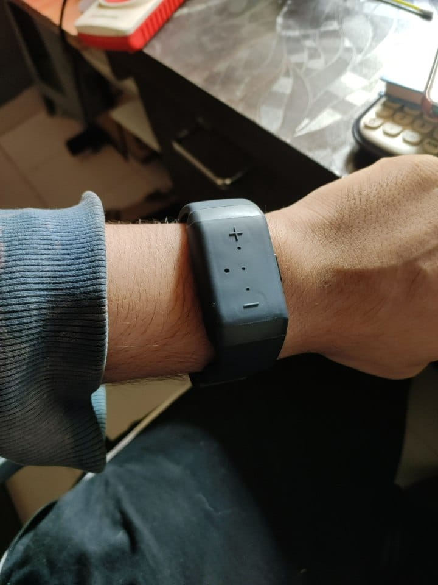
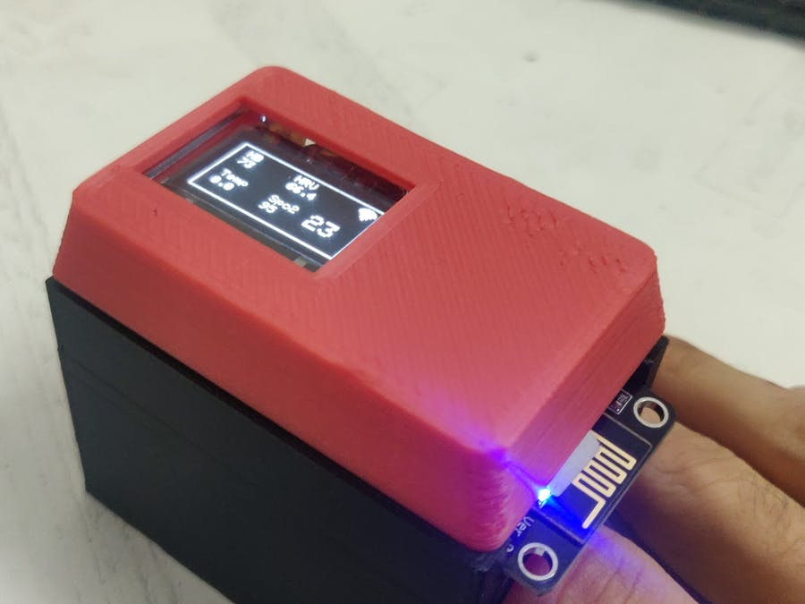
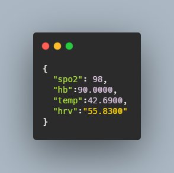
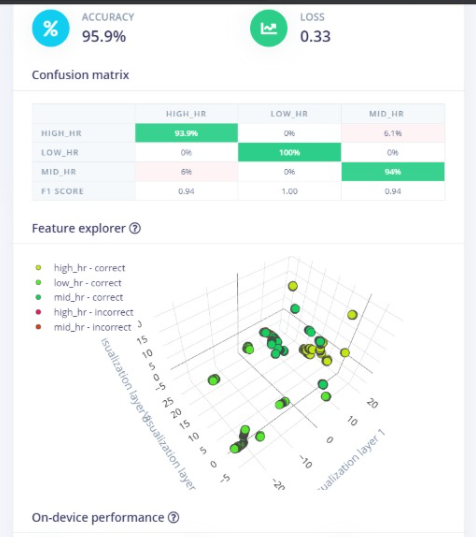
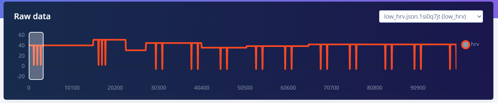
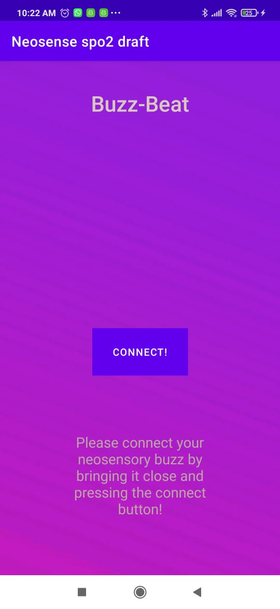
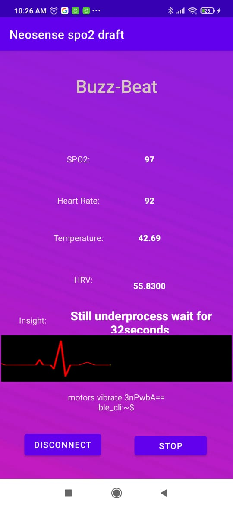

<!-- PROJECT LOGO -->
 

  

  <h3 align="center">Buzz-Beat</h3>

  

    A contactless instrument for alerting doctors!
     
    <a href="https://github.com/version0chiro/Contactless_stethoscope"><strong>Explore the docs »</strong></a>
     
     
    <a href="https://github.com/version0chiro/Contactless_stethoscope">View Demo</a>
    ·
    <a href="https://github.com/version0chiro/Contactless_stethoscope/issues">Report Bug</a>
    ·
    <a href="https://github.com/version0chiro/Contactless_stethoscope/issues">Request Feature</a>
  

<!-- ABOUT THE PROJECT -->
## About The Project
The Project is divided into four different parts and sectors and they have been listed below:
<ol>
<li><a href="https://github.com/version0chiro/Contactless_stethoscope/android_code/Neosensespo2draft">Android Application</a></li>
<li><a href="https://github.com/version0chiro/Contactless_stethoscope/web_server_code/">Web-Server</a></li>
<li><a href="https://github.com/version0chiro/Contactless_stethoscope/nodeMcu_Code/FullTestWithPost_22_1">NodeMCU-Sensors</a></li>
<li><a href="https://github.com/version0chiro/Contactless_stethoscope/edgeImpulse">Machine Learning with Edge Impulse</a></li>
</ol>
[![Product Name Screen Shot][product-screenshot]](https://example.com)

The project is aimed towards the doctors that want to get vital health related data from the paitents without having to be in contact or in a range. With the working of buzz-beat, we have made a wireless all over the globe execution for capturing and responding to sensor data for the following:
<ol>
<li>SPO2</li>
<li>Heart-Rate</li>
<li>Heart-Rate Variablity</li>
<li>Body-Temperature</li>
</ol>
<!-- image of buzz here -->
</img>
To access this data we have used the neosensory buzz! A ground shaking invention done by the people at neosensory! To find more information on the buzz be sure to click here => <a href="https://neosensory.com/product/buzz/"> Neosensory Buzz!</a>

But in general contrast, the neosensory buzz is used to convert sound data in vibration for deaf people who are unable to process these sound waves. The vibrations are given using for distinct motors attached on the band that helps the person identify different vibration patters. We wanted to go beyond this, by making something that is not just a replacement for a sense, but more like an added sense!
<!-- Image of the device here -->

</img>

Meet buzz-beat, a wireless anywhere in the world cloud based data access point for all the vital signs listen above, the hardware part of the project has been made using the following components:
<ol>
<li>NeoSensory buzz</li>
<li>Node MCU</li>
<li>Maxim Integrated MAX30100</li>
<li>MLX90614</li>
<li>Body-3.7V lipo battery</li>
</ol>

The values captured by the sensors on the device end had to be mapped onto the motors on the neosensory buzz to give tbe values for the people incharge of the paitents. This value can be sent using the the two SDKs provided by the neosensory buzz dev team,
<ul>
<li>Android SDK</li>
<li>Arduino SDK</li>
</ul>

To expand the project into a worldwide access working we choose the Android SDK and built an android app from grounds up using the example provided by here for the buzz-bluetooth library
<a href="https://github.com/neosensory/neosensory-sdk-for-android-java" >HERE</a>

<!-- Json themed image of data -->
 </img>

The data on the devices was JSONified on device itself and was sent as a post request to our custom webserver made with Node.js and express, hosted on heroku

This server assignes the JSON recieved into a local JSON and then extract raw data for the Heart-Rate aswell as the Temperature, this raw data than undergoes into the WAassemply model made using edgeImpulse for Node.js

<!-- Edge Impulse pic -->
</img>

The models were trained with 2 dense layers and 
data was processed using dsp processing, the processing done was to insure that all axises are properly being fed into the model, rather than conventional ways of thresholding this values, using edgeImpulse we were able to make it dependent on a pattern instead.

</img>

Thus the value was not gonna be same for everyone but any kind of movement which was out of the ordinary was reported back as high temperature or high hear rate!

This value is also added to the JSON on the node server and sent to the final stage of our project- The BuzzBeat APP!

<!-- Android pics here -->
</img>

The Buzz-Beat App has been made using Android Studio with Java as the backend language. The app works on two stages, the first stage is like a landing page which is displayed when the app is open, a connect button is presented to the user so that he can connect to the buzz when brought near the phone. 

For the connection between android app and neosensory buzz, the SDK is built on top of the bluetooth blessed library which is a light-weight low energy based bluetooth utility that made a lot of heavy work handy. 
</img>

Once connected, the app works with GET request on the custom node.js server, a
fter every 1 second interval a GET request is processed and the JSON at server is collected and displayed as text-view onto the App's screen. The value received is somewhat like this:

<!-- recieved JSON pic here -->
</img>

Out of these, the first four are the data that needs to be sent to the buzz on the hand of the doctor/individual wearing it. The values are mapped using a custom range mapping formula that is explained excelenty on this stackoverflow answer:
<a href="https://stackoverflow.com/questions/5731863/mapping-a-numeric-range-onto-another"> HERE </a>

In basic terms, those are made mapped inrange to 40-255 which is the range for the neosensory buzz motors to work upon. And finally these values are sent to the buzz via bluetooth, in realtime they are updated and sent over in quick intervals and the insight printed from the EdgeImpulse model is also printed here.

### Built With

* [Arduino](https://www.arduino.cc/)
* [Node.js](https://nodejs.org/en/)
* [Android Studio](https://developer.android.com/studio)
* [Edge Impulse](https://www.edgeimpulse.com/)

<!-- CONTACT -->
## Contact

Sachin Singh Bhadoriya - [@link](https://www.linkedin.com/in/sachin-singh-bhadoriya-46b18219a/) - sachinsinghbhadoriya1@gmail.com

Project Link: [https://github.com/version0chiro/Contactless_stethoscope](https://github.com/version0chiro/Contactless_stethoscope)

<!-- ACKNOWLEDGEMENTS -->
## Acknowledgements

* [TheBluePhoenix10](https://github.com/TheBluePhoenix10)
* [Neo-sense Devs](https://github.com/neosensory)

